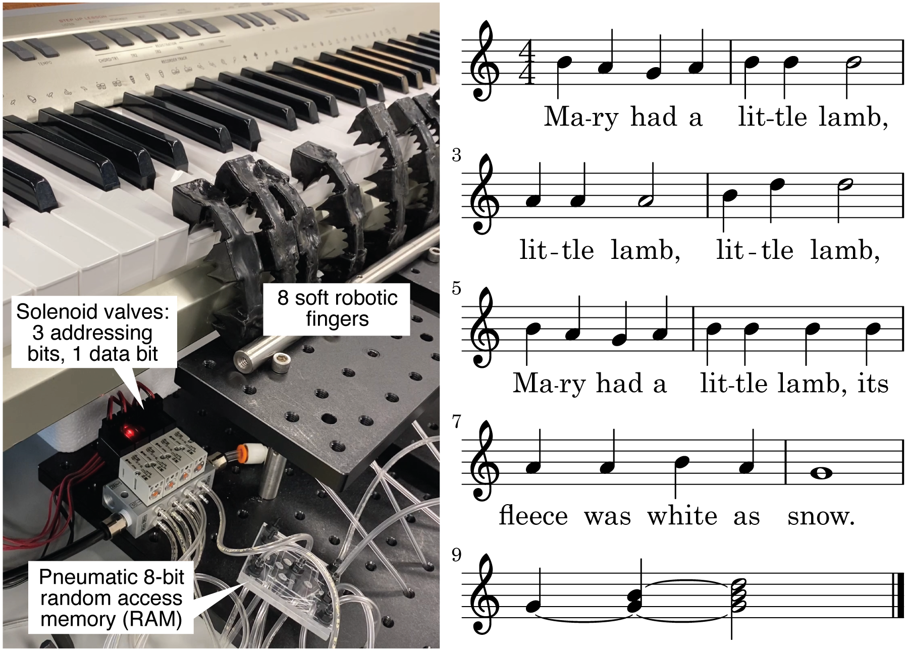

# Pneumatic Random Access Memory (RAM)

This Adobe Illustrator file contains the design of a "pneumatic RAM" device used to decrease the number of independent control lines needed to operate soft robots and other pneumatic hardware.  Instructions for engraving the design into polycarbonate sheets and bonding the device are available in [this paper](https://journals.plos.org/plosone/article?id=10.1371/journal.pone.0254524).